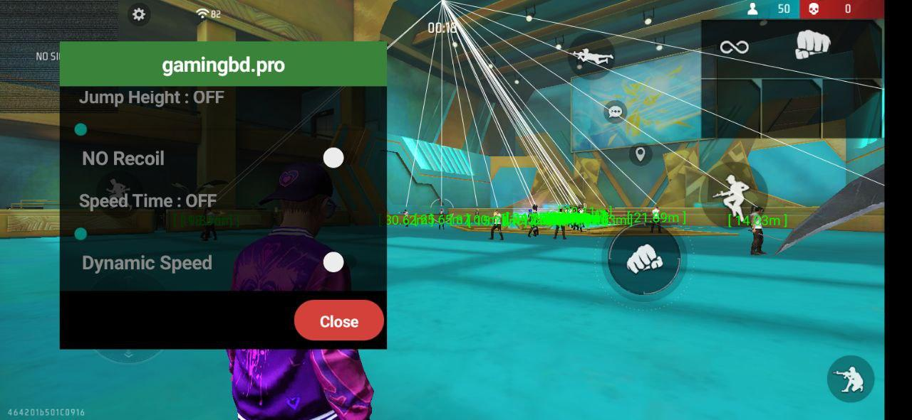
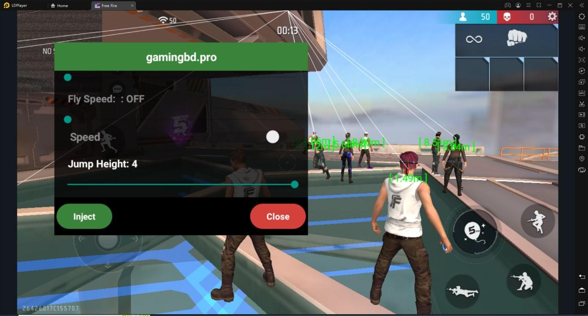

# Free Fire Cheat

### Fetures
* Aimbot ( Automtic Aim)
* ESP (Extra Sensory Perception)
* Timer Speed
* Jump Height
* Fly

### How does it work?
It first injects a shared library into the game process, and the library then hooks required game functions to change its behavior.
according to the user's command.

It has two shared libraries: client and server.
The server is injected inside the game process, and it's controlled by the client library.
The client and server use sockets to communicate with each other.

The client library is connected to Java, so it is easy to communicate with the server.

### Note
This program required root permission to operate.
Non rooted device can use virtual Android such as VMOS, VphoneGaGa, X8 Sandbox, F1 VM etc to gain superficial root access.

### Working Video:
[YouTube](https://youtu.be/q1p_UfaOqQ0)

### Screenshots in Android (LG G7 ThinQ):

### Screenshots in Android (LD Player Eumulator):

### Credits
Inject    Framework   : SsageParuders         : https://github.com/SsageParuders/AndroidPtraceInject 
Hooking   Framework   : Jay Freeman (saurik)  : https://github.com/saurik 
String    Obfuscator  : Adam Yaxley           : https://github.com/adamyaxley/Obfuscate 
Xposed    Framwork    : rovo89                : https://github.com/rovo89/Xposed 

